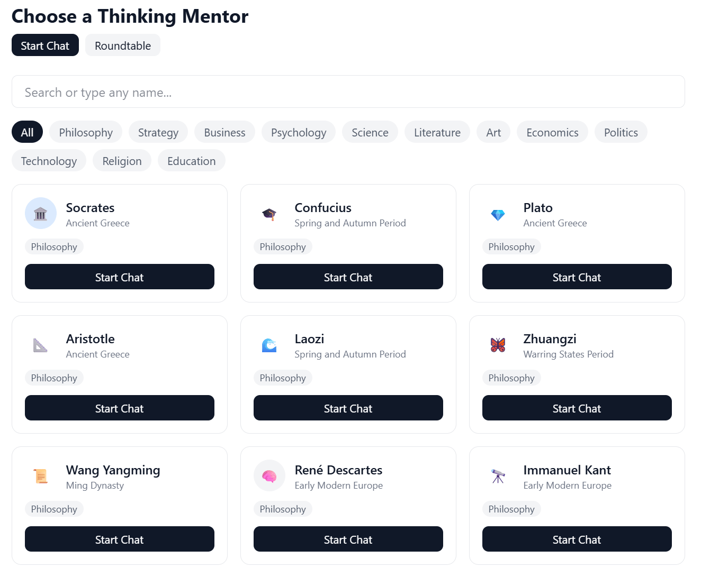
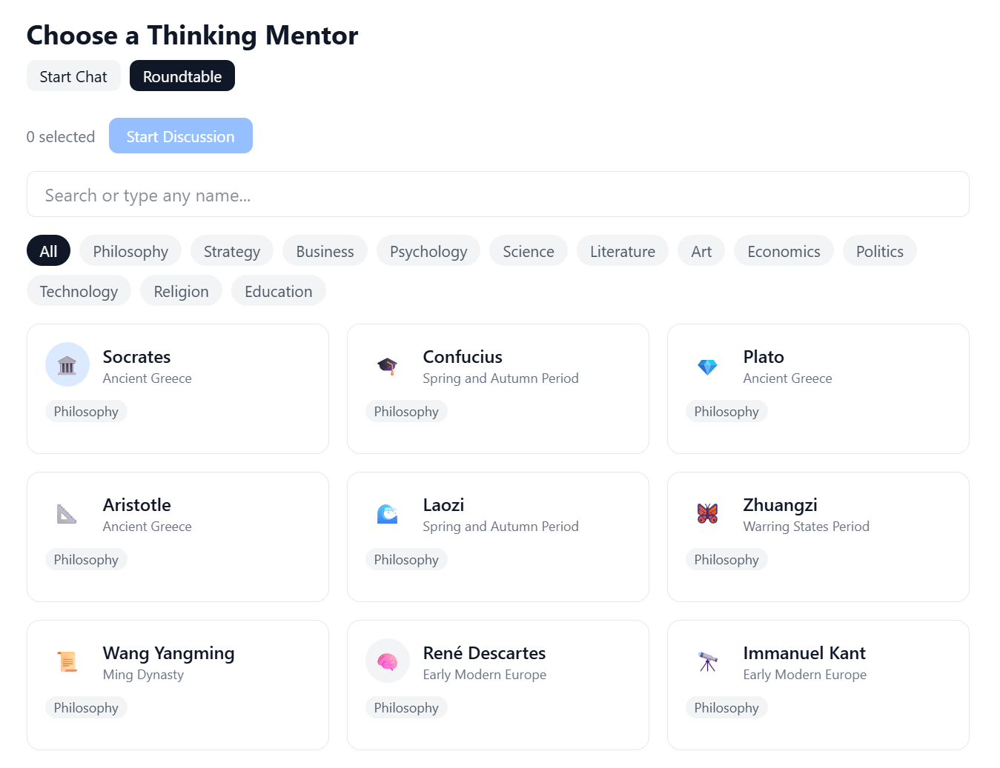
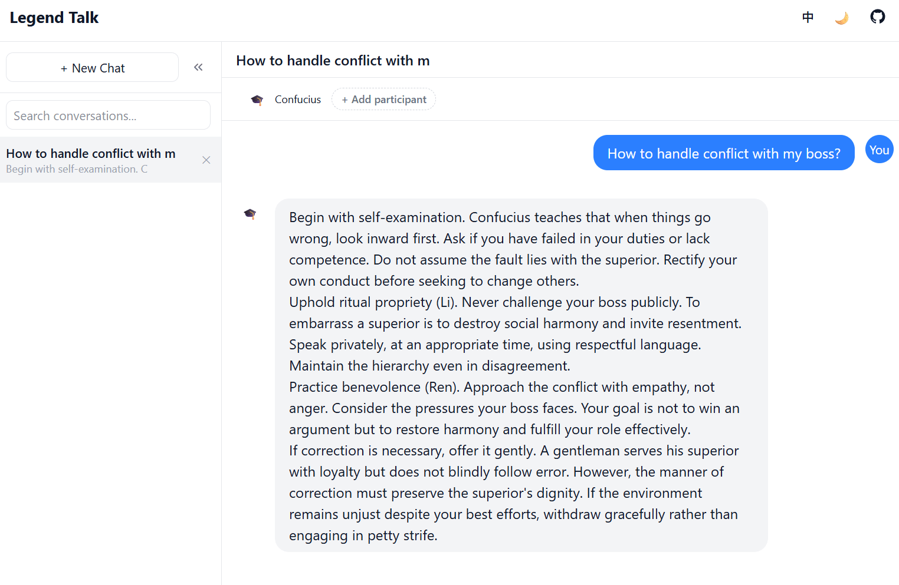

# Legend Talk

[中文说明](./README.zh.md)

Put the world's greatest thinkers in a room and let them debate your problem.

Legend Talk is a multi-round AI roundtable — pick 2-5 historical or contemporary figures, throw in a question, and watch them argue across multiple rounds, each responding to what others said. Socrates questions Munger's assumptions while Nietzsche challenges them both.

Also works as a 1-on-1 thinking tool: consult any of 100+ thinkers through their unique frameworks, not generic AI roleplay.

**Demo:** [talk.newzone.top](https://talk.newzone.top)

## Screenshots

| Choose a thinker | Roundtable mode | Chat view |
|:-:|:-:|:-:|
|  |  |  |

## Features

- **100 preset thinkers** across 12 domains: philosophy, business, science, strategy, psychology, literature, art, economics, politics, technology, religion, education
- **Free input** — type any name to consult anyone not in the presets
- **Roundtable discussions** — select 2-5 thinkers and watch them debate your question across multiple rounds
- **Seamless mode switching** — start a 1-on-1 chat, add participants anytime to turn it into a roundtable, or remove them to go back
- **Category filtering** — browse and add participants by domain
- **Configurable rounds** — set how many rounds of discussion (1-10) the thinkers should have before pausing
- **Message actions** — copy, edit, retry, or branch from any message
- **Conversation branching** — fork a new conversation from any point, preserving prior context
- **Conversation search** — search across all conversations by title, character name, or message content
- **Favorite characters** — star your most-used thinkers for quick access
- **Sharing** — generate a shareable URL for any conversation (gzip-compressed, no backend needed)
- **Conversation summary** — one-click AI summary extracting core viewpoints, disagreements, and conclusions
- **Export** — save conversations as Markdown or JSON
- **Thinking level** — configure model thinking depth (off/low/medium/high), supporting Anthropic extended thinking and OpenAI reasoning effort
- **Custom models** — manually enter any model ID beyond the presets
- **Custom LLM** — connect any OpenAI-compatible API by entering a base URL (no CORS proxy needed)
- **Multi-API support** — OpenAI, Anthropic, DeepSeek, Volcengine (Doubao), Alibaba Bailian Coding Plan
- **Bilingual** — Chinese and English interface with auto-detection
- **Dark mode**
- **Responsive** — collapsible sidebar, mobile-friendly layout
- **Local-first** — all data stored in browser localStorage, no backend required

## Supported APIs

| Provider | Models |
|----------|--------|
| OpenAI | GPT-5.4, GPT-5.4 Mini/Nano, o4 Mini, o3, GPT-4.1 series |
| Anthropic | Claude Opus 4.6, Claude Sonnet 4.6, Claude Haiku 4.5 |
| DeepSeek | DeepSeek Chat, DeepSeek Reasoner |
| Volcengine | Doubao Seed 2.0 Pro, Doubao 1.5 series, DeepSeek R1/V3 |
| Alibaba Bailian | Qwen 3.5 Plus, Kimi K2.5, GLM-5, MiniMax M2.5, etc. |

All providers support custom model IDs. Default: DeepSeek Chat. You can also add any OpenAI-compatible API via the "Custom" provider option.

You can also force the UI language via URL parameter: `?lang=zh` or `?lang=en`.

## Quick Start

```bash
npm install
npm run dev
```

Open http://localhost:5173, go to Settings, enter your API key, then start chatting. If you hit a CORS error, the app will prompt you to enable a public proxy with one click.

## CORS Proxy

Most LLM APIs block direct browser requests. Deploy a simple Cloudflare Worker as a CORS proxy:

1. Go to [Cloudflare Workers](https://dash.cloudflare.com) → Create Worker
2. Paste this code and deploy:

```javascript
export default {
  async fetch(request) {
    const url = new URL(request.url);
    const targetUrl = url.pathname.slice(1) + url.search;
    if (!targetUrl || !targetUrl.startsWith('https://')) {
      return new Response('Usage: /https://target-api.com/path', { status: 400 });
    }
    if (request.method === 'OPTIONS') {
      return new Response(null, {
        headers: {
          'Access-Control-Allow-Origin': '*',
          'Access-Control-Allow-Methods': 'GET, POST, PUT, DELETE, OPTIONS',
          'Access-Control-Allow-Headers': '*',
          'Access-Control-Max-Age': '86400',
        },
      });
    }
    const response = await fetch(targetUrl, {
      method: request.method,
      headers: request.headers,
      body: request.body,
    });
    const newResponse = new Response(response.body, response);
    newResponse.headers.set('Access-Control-Allow-Origin', '*');
    return newResponse;
  },
};
```

3. Enter the Worker URL in Settings → CORS Proxy

## Project Structure

```
src/
  adapters/       # LLM API adapters (OpenAI, Anthropic, etc.)
  characters/     # Character presets and custom character generation
  components/     # React components
  hooks/          # useChat, useRoundtable
  i18n/           # Internationalization
  stores/         # Zustand state management
  utils/          # Prompt building, export utilities
  types.ts        # Type definitions
```

## Tech Stack

React 19, Vite, Tailwind CSS v4, Zustand, i18next, React Router, TypeScript

## Scripts

| Command | Description |
|---------|-------------|
| `npm run dev` | Start dev server |
| `npm run build` | Type-check and build for production |
| `npm run test` | Run tests |
| `npm run preview` | Preview production build |

## Deploy

Build and deploy the `dist/` folder to any static hosting (Vercel, Netlify, GitHub Pages, etc.):

```bash
npm run build
```

Uses hash-based routing (`/#/chat/...`) so no server-side routing config needed.

## License

MIT
